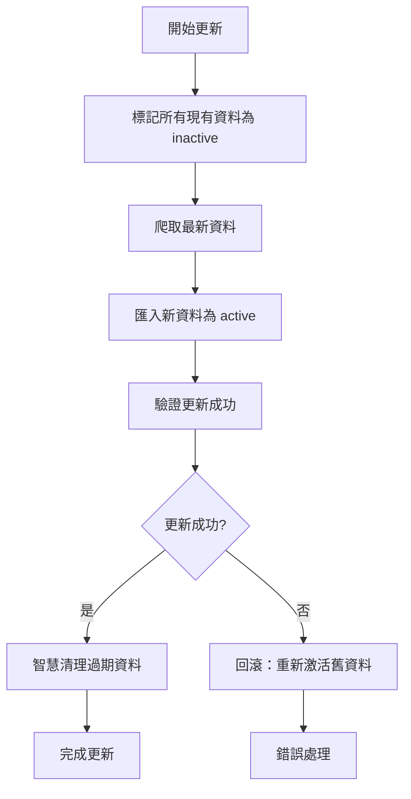

# 租屋資料更新策略 - 軟刪除最佳實踐

## 📋 背景

租屋資料每天都在變化，需要一個可靠的更新策略來保持資料的新鮮度，同時避免資料丟失和服務中斷。

## ❌ 舊做法的問題（全量刪除）

- **資料安全風險**：爬取失敗會丟失所有資料
- **通勤時間流失**：已計算的昂貴通勤時間數據會丟失
- **用戶體驗差**：更新期間網站沒有資料可顯示
- **無法回滾**：出問題時無法恢復
- **運營成本高**：需要重新計算所有通勤時間

## ✅ 新策略：軟刪除 + 批次更新

### 核心概念

使用資料庫中的 `isActive` 欄位實現軟刪除，確保資料更新的原子性和安全性。

### 更新流程



### 階段詳解

#### 階段 1: 標記現有資料
```sql
UPDATE listings SET isActive = false, updatedAt = NOW() WHERE isActive = true;
```

#### 階段 2: 爬取並匯入新資料
- 爬蟲執行，產生最新資料
- 新資料自動標記為 `isActive = true`
- 如果爬取失敗，舊資料仍然可用

#### 階段 3: 智慧清理
- **簡單清理**：刪除 N 天前的 inactive 資料
- **智慧清理**：保留有通勤時間的 inactive 資料

## 🛡️ 安全機制

### 1. 原子性操作
- 先標記後匯入，確保資料一致性
- 失敗時自動回滾機制

### 2. 資料可見性控制
所有 API 端點只返回 `isActive: true` 的資料：
```typescript
const where = {
  isActive: true,  // 只顯示 active 資料
  // ... 其他條件
};
```

### 3. 錯誤恢復
```typescript
// 回滾：重新激活之前的資料
await prisma.listing.updateMany({
  where: { 
    isActive: false,
    updatedAt: { lt: new Date(startTime) }
  },
  data: { isActive: true }
});
```

## 🚀 API 端點

### 批次更新 API
```bash
POST /api/import/batch-update
Content-Type: multipart/form-data

# 參數
file: JSON 檔案
batchSize: 批次大小 (預設: 1000)
keepOldDataDays: 保留天數 (預設: 7)
preserveCommuteData: 保留通勤資料 (預設: true)
```

### 智慧清理 API
```bash
POST /api/import/cleanup
Content-Type: application/json

{
  "keepDays": 7,        # 保留天數
  "smart": true         # 智慧清理模式
}
```

### 資料統計 API
```bash
GET /api/import/stats

# 回應
{
  "activeListings": 1500,
  "inactiveListings": 200,
  "totalCommuteData": 850,
  "dataFreshness": {
    "oldest": "2024-06-22T03:00:00.000Z",
    "newest": "2024-06-29T03:00:00.000Z"
  },
  "healthScore": "healthy"
}
```

## ⏰ 自動化執行

### Cron Job 配置

#### 每日更新（推薦）
```bash
# 每天凌晨 3:00 執行，保留 7 天舊資料
0 3 * * * cd /path/to/rentrent/apps/crawler && python3 daily_update.py --cleanup-days=7 >> logs/cron.log 2>&1
```

#### 週度深度清理
```bash
# 每週日凌晨 2:00 執行，只保留 3 天資料
0 2 * * 0 cd /path/to/rentrent/apps/crawler && python3 daily_update.py --cleanup-days=3 >> logs/cron_weekly.log 2>&1
```

#### 健康檢查
```bash
# 每小時測試（可選）
0 * * * * cd /path/to/rentrent/apps/crawler && python3 daily_update.py --test >> logs/health_check.log 2>&1
```

### NPM 腳本

```bash
# 測試模式
pnpm crawler:test

# 正式更新
pnpm crawler:update

# 手動指定參數
cd apps/crawler && python daily_update.py --cleanup-days=7 --backend-url=http://localhost:8000
```

## 📊 每日更新腳本功能

### 執行流程
1. **爬取階段**：執行爬蟲收集最新資料
2. **更新階段**：使用軟刪除策略批次更新資料庫
3. **清理階段**：智慧清理過期資料
4. **報告階段**：生成詳細的更新報告

### 參數選項
```bash
python daily_update.py [OPTIONS]

選項:
  --test                測試模式（不執行實際操作）
  --cleanup-days INT    保留幾天的舊資料（預設7天）
  --batch-size INT      批次處理大小（預設1000）
  --backend-url TEXT    後端API網址（預設localhost:8000）
```

### 日誌記錄
- 自動生成日期命名的日誌檔案
- 記錄詳細的執行過程和統計資料
- 錯誤追蹤和調試資訊

## 💡 智慧清理策略

### 簡單清理
刪除 N 天前的所有 inactive 資料及其相關通勤時間。

### 智慧清理（推薦）
- **刪除**：無通勤時間資料的舊物件
- **保留**：有通勤時間資料的舊物件
- **優勢**：保護已投入運算成本的寶貴資料

```typescript
// 智慧清理邏輯
const listingsToDelete = await prisma.listing.findMany({
  where: {
    isActive: false,
    updatedAt: { lt: cutoffDate },
    commuteTimes: { none: {} }  // 沒有通勤時間資料
  }
});

const listingsToPreserve = await prisma.listing.count({
  where: {
    isActive: false,
    updatedAt: { lt: cutoffDate },
    commuteTimes: { some: {} }  // 有通勤時間資料
  }
});
```

## 📈 優勢比較

| 特徵 | 全量刪除 | 軟刪除策略 |
|------|----------|------------|
| **資料安全** | ❌ 高風險 | ✅ 零風險 |
| **通勤時間保留** | ❌ 全部丟失 | ✅ 智慧保留 |
| **更新期間可用性** | ❌ 無資料 | ✅ 持續可用 |
| **錯誤恢復** | ❌ 無法回滾 | ✅ 自動回滾 |
| **資料品質** | ❌ 不可控 | ✅ 可驗證 |
| **運營成本** | ❌ 高 | ✅ 低 |
| **維護複雜度** | ✅ 簡單 | ⚠️ 中等 |

## 🔧 實作檔案

### 後端相關
- `apps/backend/src/services/importService.ts` - 核心邏輯
- `apps/backend/src/routes/import.ts` - API 端點
- `apps/backend/src/controllers/listings.controller.ts` - 資料過濾

### 爬蟲相關
- `apps/crawler/daily_update.py` - 每日更新主腳本
- `apps/crawler/crontab-example.txt` - Cron 配置範例

### 配置相關
- `package.json` - NPM 腳本
- `apps/backend/prisma/schema.prisma` - 資料庫模型

## 🚨 注意事項

### 部署前檢查
1. ✅ 確保資料庫備份
2. ✅ 測試模式驗證流程
3. ✅ 監控系統設置
4. ✅ 錯誤通知配置

### 監控指標
- 每日更新成功率
- 資料新鮮度
- 錯誤率和恢復時間
- 磁碟空間使用

### 維護建議
- 定期檢查日誌檔案大小
- 監控 inactive 資料累積
- 適時調整清理策略參數
- 備份重要的通勤時間資料

## 📚 相關文檔

- [Prisma 軟刪除指南](https://www.prisma.io/docs/concepts/components/prisma-client/crud#deleting-records)
- [Cron 表達式語法](https://crontab.guru/)
- [Docker Compose 最佳實踐](https://docs.docker.com/compose/best-practices/)

---

**此策略為租屋平台資料更新的最佳實踐，確保高可用性和資料安全性。** 